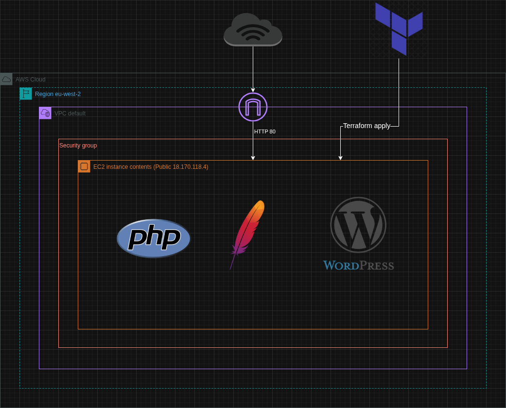
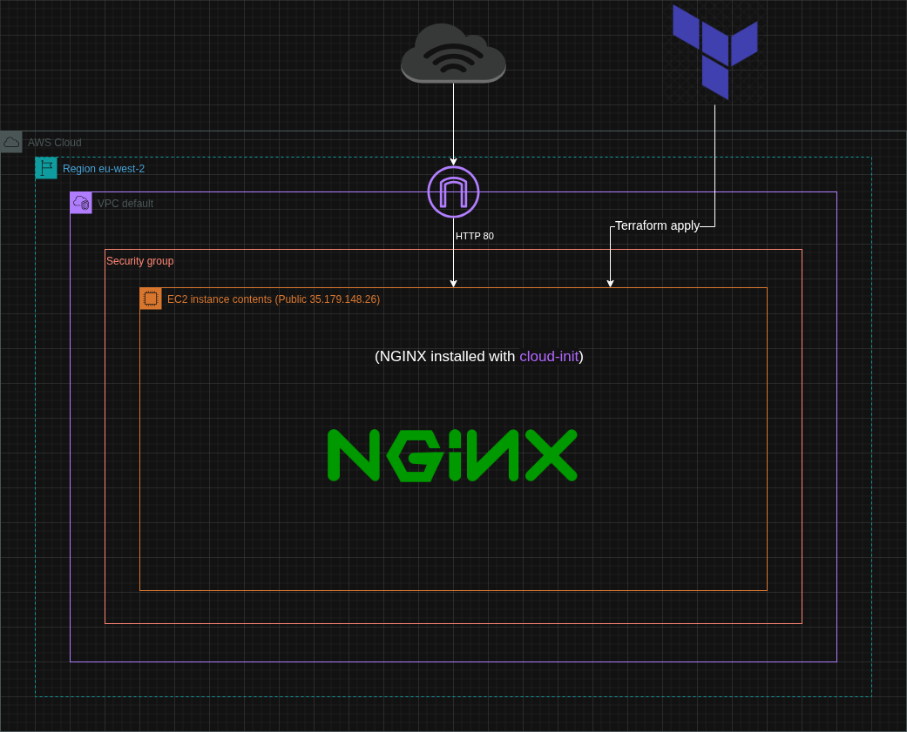

# Terraform Module

## Overview

This repository contains my work from the **Terraform module** at *CoderCo Academy*, including learning exercises and a first full project.
I explored *Infrastructure as Code (IaC)*, *AWS EC2 provisioning*, networking, security, and automation using *Terraform*.

## Skills Learned
- Terraform basics: providers, resources, and state management
- AWS EC2 provisioning and networking
- Security groups and HTTP access configuration
- Automating server setup with user data scripts
- Version-controlled, reproducible infrastructure
- Debugging Terraform applies and managing resource dependencies
- Thinking in terms of infrastructure as code for automation and scalability

## Directories

- **[Notes](/notes/)** – Terraform basic notes and key takeaway, including advanced commands

- **[Practicing Terraform](/terraform-aws-demo/)** – Practice exercises following video tutorials to learn Terraform basics

- **[Deploy WordPress with Terraform on AWS](/terraform-wordpress/)** – First full project: deployed a live WordPress server on AWS EC2 with automated setup, security groups, and publicly accessible site

- **[Deploy NGINX with Terraform and Cloud-Init](/terraform-nginx/)** – Second full project: deployed an NGINX web server on AWS EC2 using Terraform and cloud-init, fully automated with no manual setup. Includes EC2 provisioning, security groups, cloud-init yaml file for NGINX installation, and outputs for public IP/DNS
