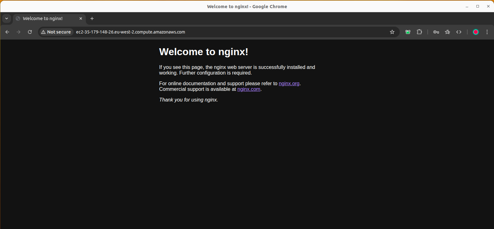
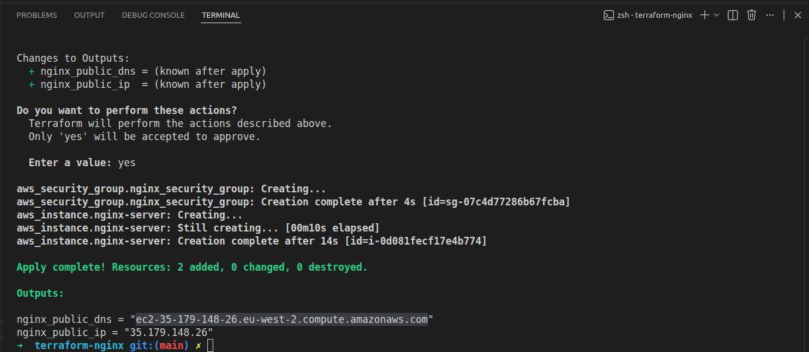

# EC2 Deployment with Terraform and Cloud-Init (NGINX)

## Overview
This project demonstrates deploying an *NGINX server* on AWS EC2 using *Terraform* and *cloud-init*, provisioning infrastructure automatically with no manual steps.

The setup includes an **EC2 instance**, **security group** allowing HTTP traffic, **cloud-init YAML file**, publicly accessible NGINX default page.

- 
- 

---

## How It Works
1. Terraform provisions an EC2 instance in the default VPC
2. A security group allows inbound HTTP traffic on port 80
3. Cloud-init handles the EC2 configuration:
    - Updates packages
    - Install NGINX
    - Starts and enables NGINX to run on boot

---

## Technologies used
- **Terraform**
- **AWS EC2**
- **Ubuntu**
- **NGINX**
- **Cloud-init**

---