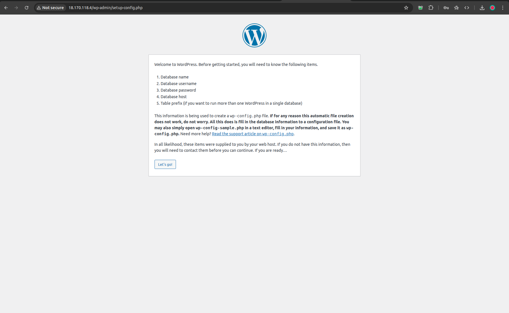
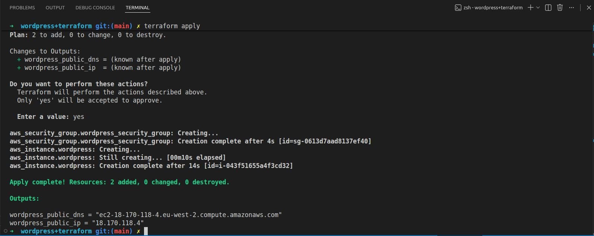

# Deploy WordPress With Terraform on AWS EC2

## Overview
This project demonstrates deploying a full **WordPress** setup on AWS using **Terraform**, provisioning real infrastructure end-to-end.

The setup includes an **EC2 Instance**, **security groups**, **user data** for automated installation, and a publicly accessible WordPress site.

- 
- 

---

## How It Works
1. Terraform provisions an EC2 Instance in the default VPC
2. A security group allows inbound HTTP traffic on port 80
3. A user data script:
    - Installs Apache & PHP
    - Downloads and configures WordPress
    - Sets correct permissions
4. WordPress is accessible via the instance's public IP

---

## Technologies Used
- **Terraform**
- **AWS EC2**
- **Ubuntu**
- **Apache**
- **PHP**
- **WordPress**

